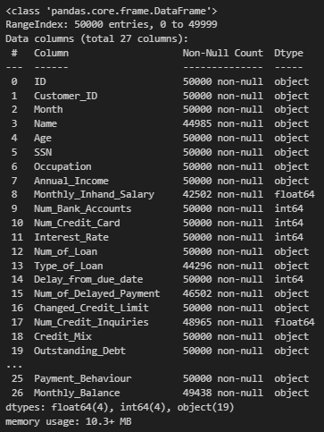
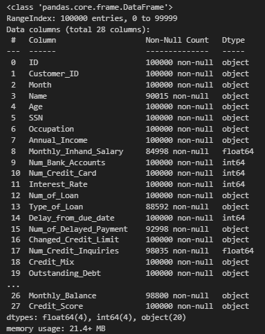
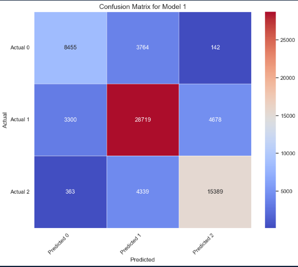
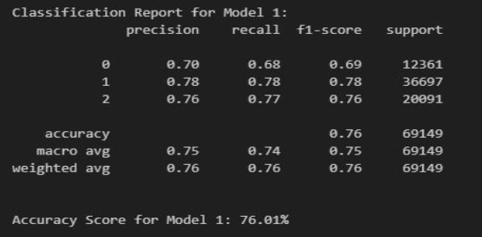
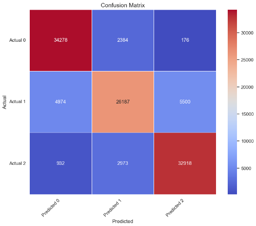
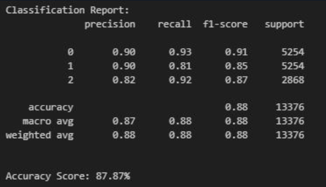

# Project-4-Credit-Worthiness

## Credit Worthiness Machine Learning Model

This model was developed for potential clients in the financial sector to streamline the prediction of the worthiness of an applicant. It simulates a real-world scenario from data onboarding to model development and optimization.

**Version 1.0**

## Table of Contents
1. [Executable Files](#executable-files)
2. [Resources](#resources)
3. [Installation](#installation)
4. [Usage](#usage)

## Executable Files
- `01 - SQLite_db.ipynb`
- `02 - db to df.ipynb`
- `03 - data_cleaning.ipynb`
- `04 - Credit_Score.ipynb`

## Resources
- `df1.csv`
- `test_final.csv`
- `train_final.csv`
- `train.csv`

## Installation
- pandas
- numpy
- seaborn
- matplotlib.pyplot
- sqlite3

## Usage
1. **SQLite_db.ipynb:** Create a SQL database from the test and train CSV files in the resource folder. Execute to generate `credit_worthiness.sqlite`.
2. **db to df.ipynb:** Access the database and create test and train dataframes using pandas.
3. **data_cleaning.ipynb:** Handle nulls and empty cells in the dataset.
4. **Credit_Score.ipynb:** Train and test iterations of the machine learning model. Generates performance graphics and reports detailing the strengths and weaknesses of the final model.

## Walk-through
The initial test and train dataframes have the following characteristics.

    

The first model generated the following confusion matrix and classification report.

After oversampling and decision tree classifier, the smote model generated the following confusion matrix and classification report.

This final model was able to generate an overall accuracy of 88%. Meaning that this model was able to correct categorize individual into the correct credit rating of poor, standard and good.
